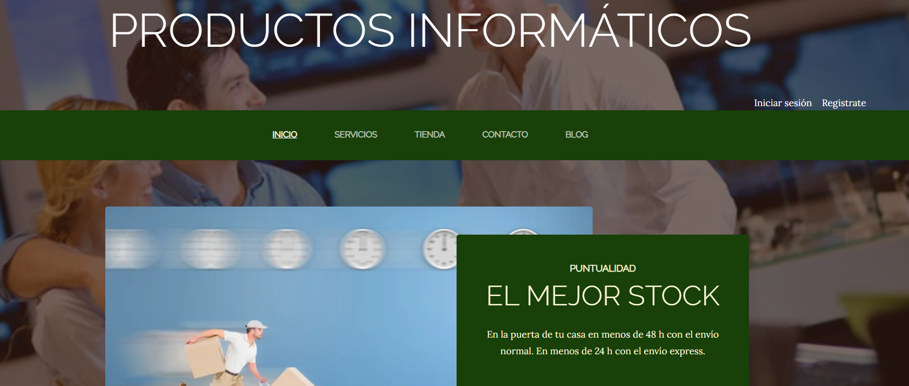
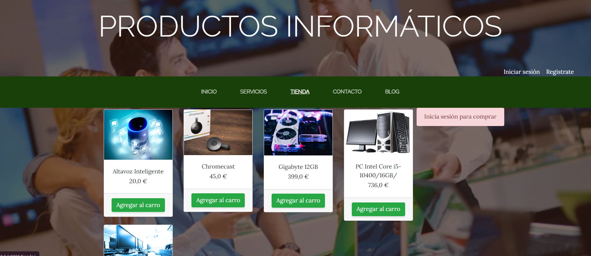
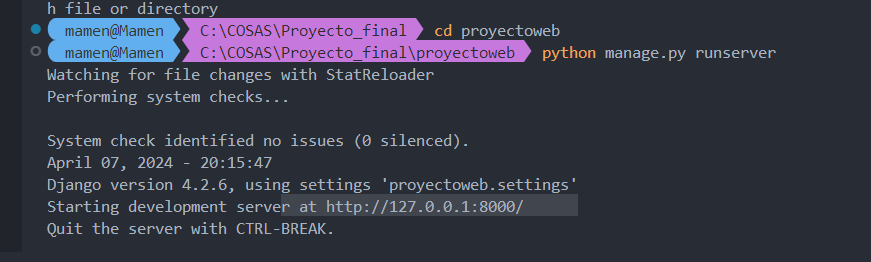

## 🎯 Mi objetivo 
Decidí lanzar una página web enfocada en productos informáticos, diseñada para simplificar la experiencia de compra con funciones para añadir, eliminar y gestionar productos en el carro. Paralelamente, integraría un blog para compartir reseñas y consejos sobre tecnología. El objetivo era crear un espacio que no solo facilitara la adquisición de tecnología sino que también educara e informara a los usuarios sobre las últimas tendencias y productos del mercado

!

   

## 💻 Tecnologías 
🔹PYTHON 
🔹Django
🔹DB Browser for SQLite

## 🔥 Herramientas
🔹Git / GitHub  
🔹Visual Studio Code  

  

## 🚀 Para ejecutar: 

1.Clona el repositorio.  

  

## 🪢 Branches 

| BRANCH   | Descripción                                                                      |
| -------- | ------------------------------------------------------------------------------------- |
| main     | Rama principal. Aquí solo aparecerán las versiones finales y funcionales de las historias de usuario|

  

## 🤝 Contributions 

Las contribuciones son bienvenidas. Si tienes alguna sugerencia para mejorar, por favor, este es el momento.
 

## 🔗 Deploy on Render 

https://proyecto-final-9n00.onrender.com

